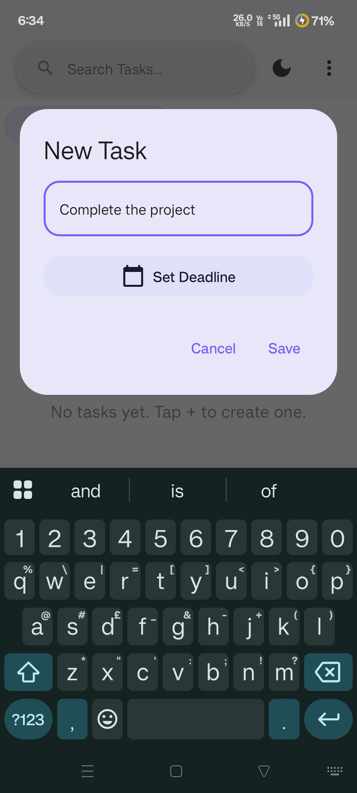
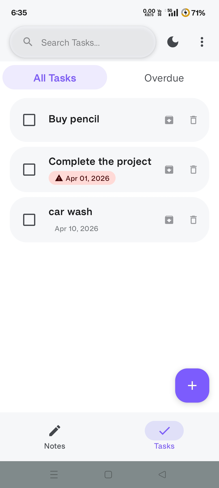
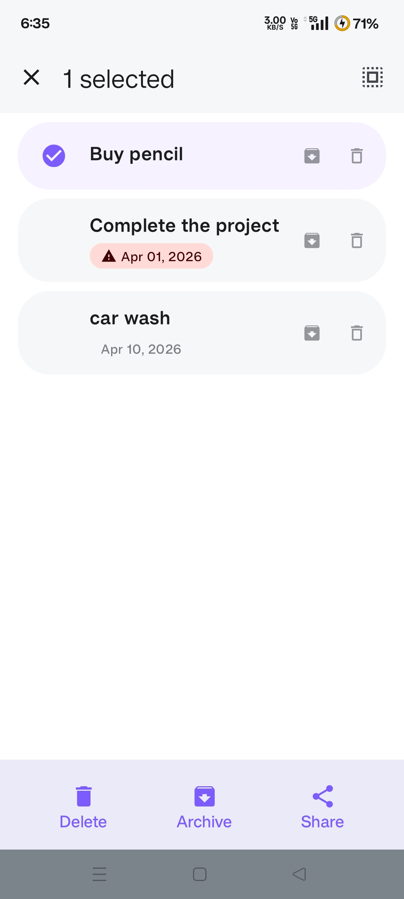
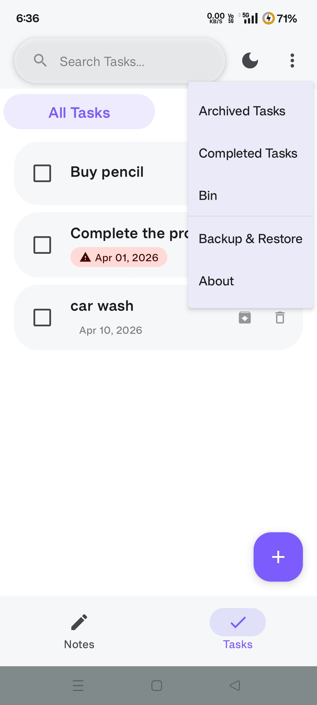
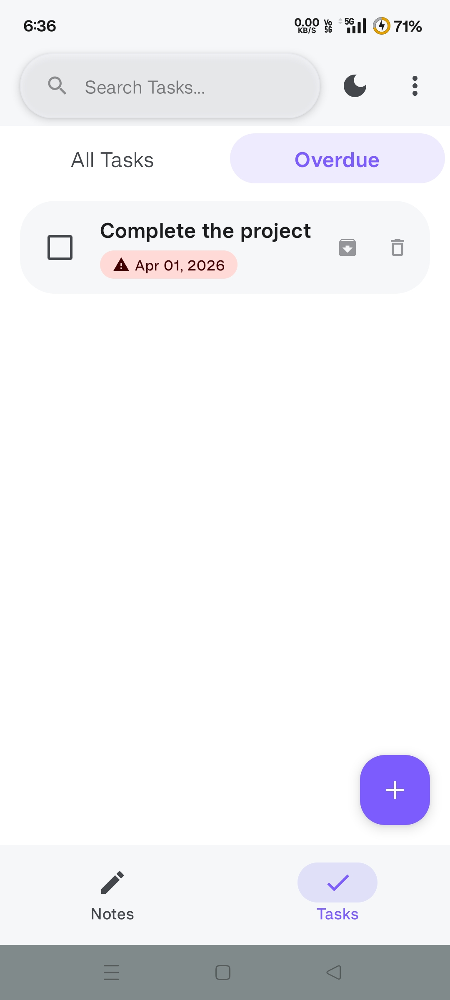
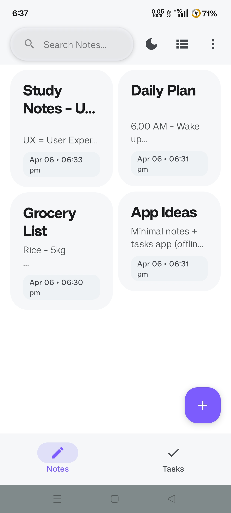
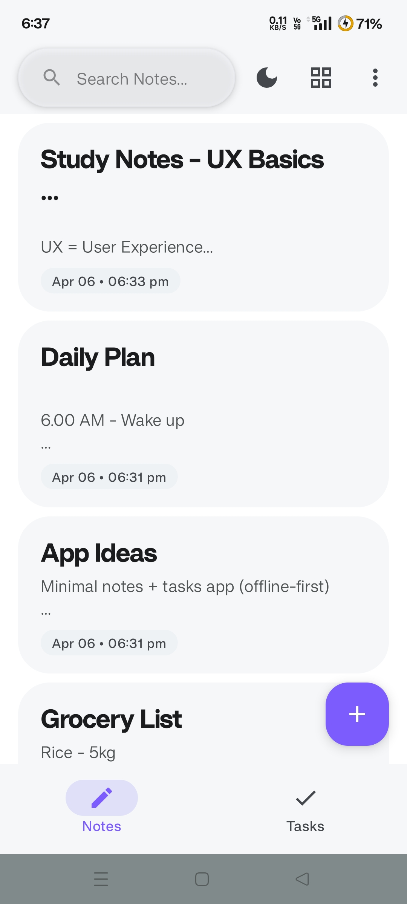
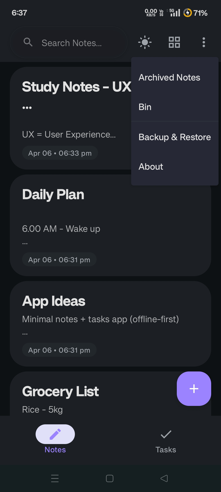
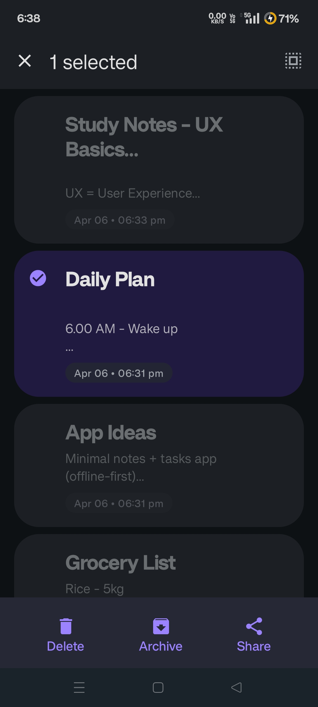
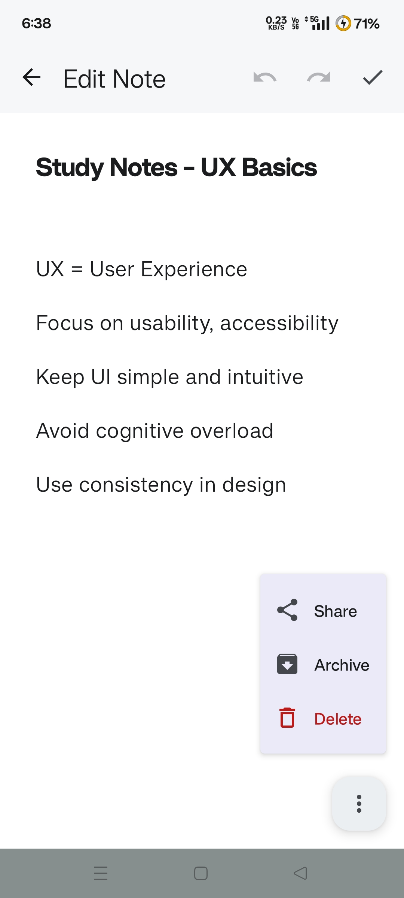

# 🐯 TigerFlow

**Focus on what matters. Seamlessly manage your thoughts and tasks.**

---

> A minimalist, privacy-first Android application built with modern development practices. Designed for speed, offline reliability, and a fluid user experience.

## ✨ Key Features

* 🔒 **100% Offline:** Your data never leaves your device (Room Database).
* 🎨 **Modern UI:** Responsive design built entirely with Jetpack Compose.
* 🌗 **Dynamic Theming:** Native support for Light and Dark modes.
* ✅ **All-in-One:** Streamlined note-taking and task tracking.

---

## 📱 Screenshots

  
  
  
  
  
  
  
  
  
  

---

## 🛠️ Tech Stack

* **Language:** Kotlin
* **UI:** Jetpack Compose
* **Architecture:** MVVM Pattern
* **Database:** Room (SQLite)
* **Concurrency:** Coroutines & Flow

---

## 📥 Quick Start

1. Click the **Download Latest APK** badge above.
2. Install the `.apk` on your Android device.
3. Enable "Install from Unknown Sources" if required.

---

